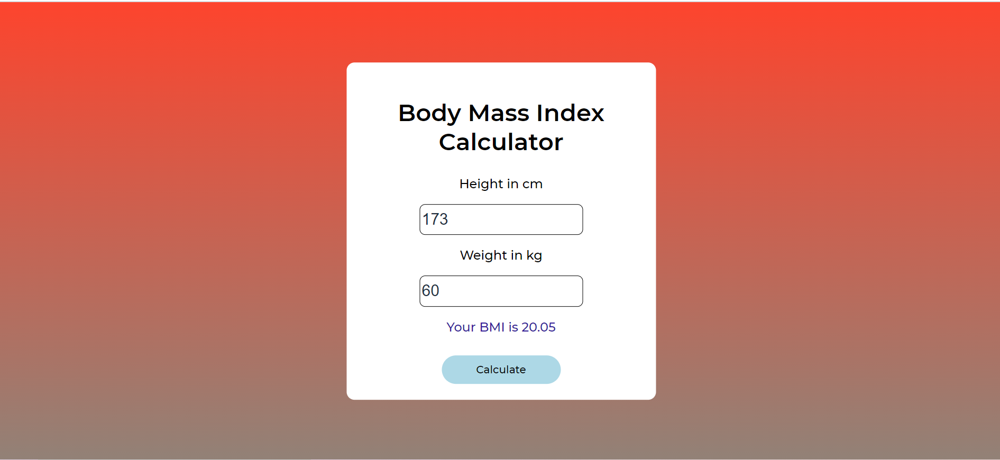

<h1>BMI Calculator using JS</h1>

<p>Calculates the Body Mass Index of a person, provided with a BMI chart</p>

### Use of the Project:

<p>User enters values - height in cm and weight in kg and clicks on "calculate" button to obtain BMI value and compares the value in the given BMI chart.</p>

<h3>Used Technologies</h3>
<ul>
  <li>HTML5</li>
  <li>CSS3</li>
  <li>JavaScript</li>
</ul>

#### Steps to Use:

---

- Download or clone the repository

```
git clone https://github.com/dhiwinsamrich/Web_Development_Mini_Projects.git
```

- Go to the directory
- Run the index.html file
- Start Calculatings!

<h3> Demo </h3>

