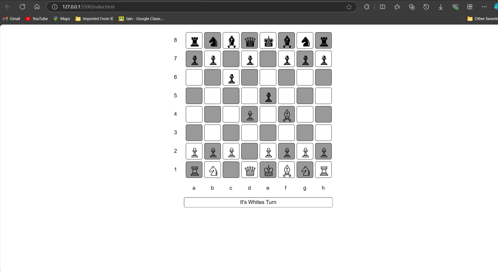

<h1>Chess Game</h1>

<p>A Chess Game written in HTML, CSS and JAVASCRIPT .</p>

### Use of the Project:

<p>This chess game is just for entertainment purpose . </p>

<h3>Used Technologies</h3>
<ul>
    <li>HTML5</li>
    <li>CSS3</li>
    <li>JavaScript</li>
</ul>

#### Steps to Use:

---

- Download or clone the repository

```
git clone https://github.com/dhiwinsamrich/Web_Development_Mini_Projects.git
```

- Go to the directory
- Run the index.html file
- Start Playing!!!


<h3> Screenshot </h3>



<br>