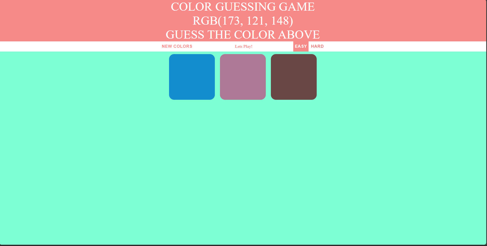

### Color Guessing Game
A RGB color guessing game.It has 2 levels easy and hard. In easy level you have 3 boxes and you have to guess from those 3 boxes but in hard level you have 6 boxes.

### Use of the Project:
It is a great game to play as it is with rgb we can just see the rgb and guess the color . This can be used if get a better understanding of rgb.

### Tech Stack
* HTML5
* CSS3
* JAVASCRIPT


#### Steps to Use:

---

- Download or clone the repository

```
git clone https://github.com/dhiwinsamrich/Web_Development_Mini_Projects.git
```

- Go to the directory
- Run the index.html file
- Start guessing!

---

### Screenshots


