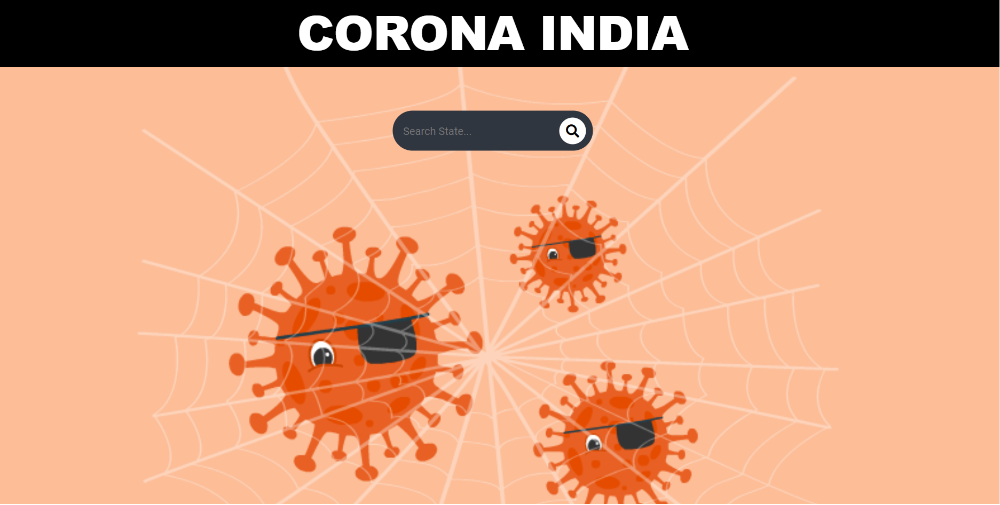

<h1 align="center"> 🌵 Go-Corona</h1>
<hr>
<br>
<p>Beginner friendly project which uses basics API's and provide real time data of vaccines and corona cases.
<h1 align="center">👩‍💻 Tech stack</h1>
✔ HTML/HBS <br>
✔ CSS <br>
✔ JavaScript <br>
✔ NodeJs <br>
✔ ExpressJs <br>
</p>
<h1 align="center"> 🌎 Use</h1>
- Download or clone the repository

```
git clone https://github.com/dhiwinsamrich/Web_Development_Mini_Projects.git
```

- Go to the directory
```
cd Corona-tracker
```

- Run the command
```
npm start
```
- Start Local sever at 1338
```
http://localhost:1338
```
<hr>
<h1 align="center">🖼 Screenshot</h1>



