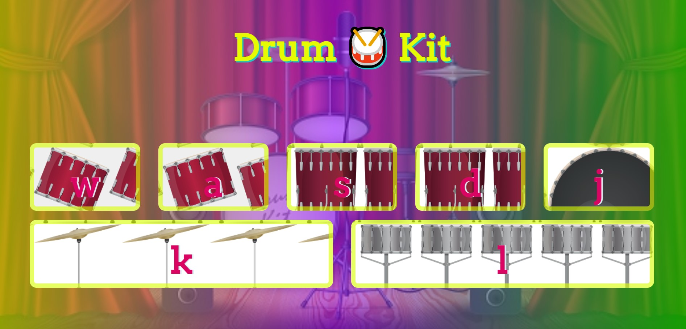

<h1>Drum kit web app</h1>

### Use of the Project:

<p>It is simple web game whire you can enjoy the playing the music in your free time. </p>

 ### Used Technologies:

- HTML5
- CSS3
- JavaScript


#### Steps to Use:

---

- Download or clone the repository

```
git clone https://github.com/dhiwinsamrich/Web_Development_Mini_Projects.git
```

- Go to the directory
- Run the index.html file by copying the file path and pasting it in your browser
- And Enjoy

### ScreenShot



