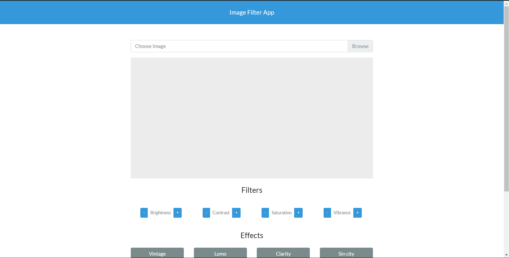
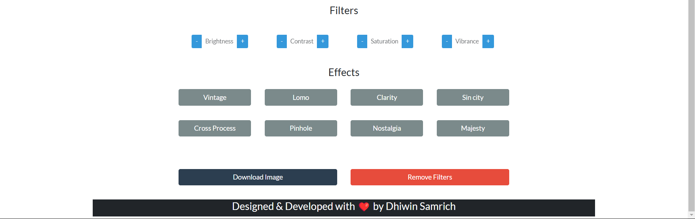

<h1>Image Filter App</h1>

<p>An Awesome Image Filter App written in HTML, CSS, JavaScript and CamanJS .</p>

### Use of the Project:

<p>A Image Filter App helps to apply filters to your image as well modify different image characteristics like brightness etc. </p>

<h3>Used Technologies</h3>
<ul>
  <li>HTML5</li>
  <li>CSS3</li>
  <li>JavaScript</li>
  <li>CamanJS</li>
</ul>

#### Steps to Use:

---

- Download or clone the repository

```
git clone https://github.com/dhiwinsamrich/Web_Development_Mini_Projects.git
```

- Go to the directory
- Run the index.html file
- Upload The Image
- Apply Filter to it
- Download the Modifed Image by clicking On Download Button.
- And Here you have Awesome Modified Image

<h3> ScreenShots </h3> 


<br>

