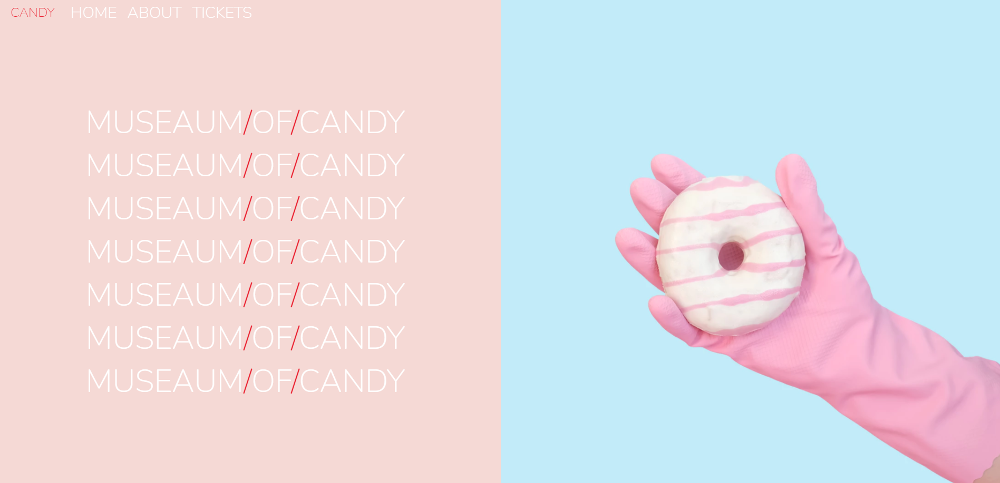
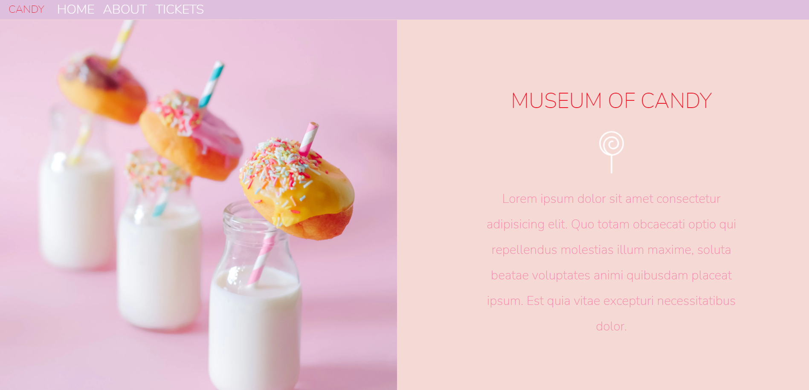

Museum of Candies website
This website contains frontend for Museum of Candies website, and technologies used are

HTML

CSS

Steps to Use:
Download or clone the repository
git clone https://github.com/dhiwinsamrich/Web_Development_Mini_Projects.git
Go to the directory
Run the index.html file

Output

