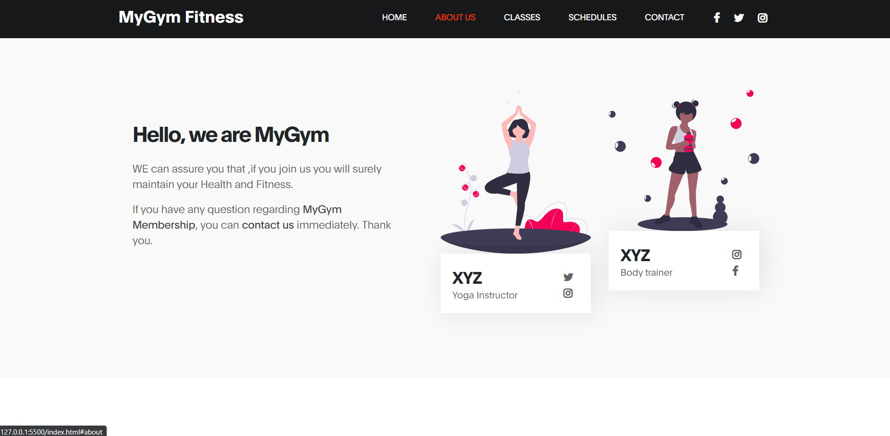

# MyGym Fitness website
This website contains frontend for Mygym website, and technologies used are 
* HTML    
 
* CSS

* JS(BOOTSTRAP)

<br>

#### Steps to Use:

---

- Download or clone the repository

```
git clone https://github.com/dhiwinsamrich/Web_Development_Mini_Projects.git
```

- Go to the directory
- Run the index.html file

## Output





